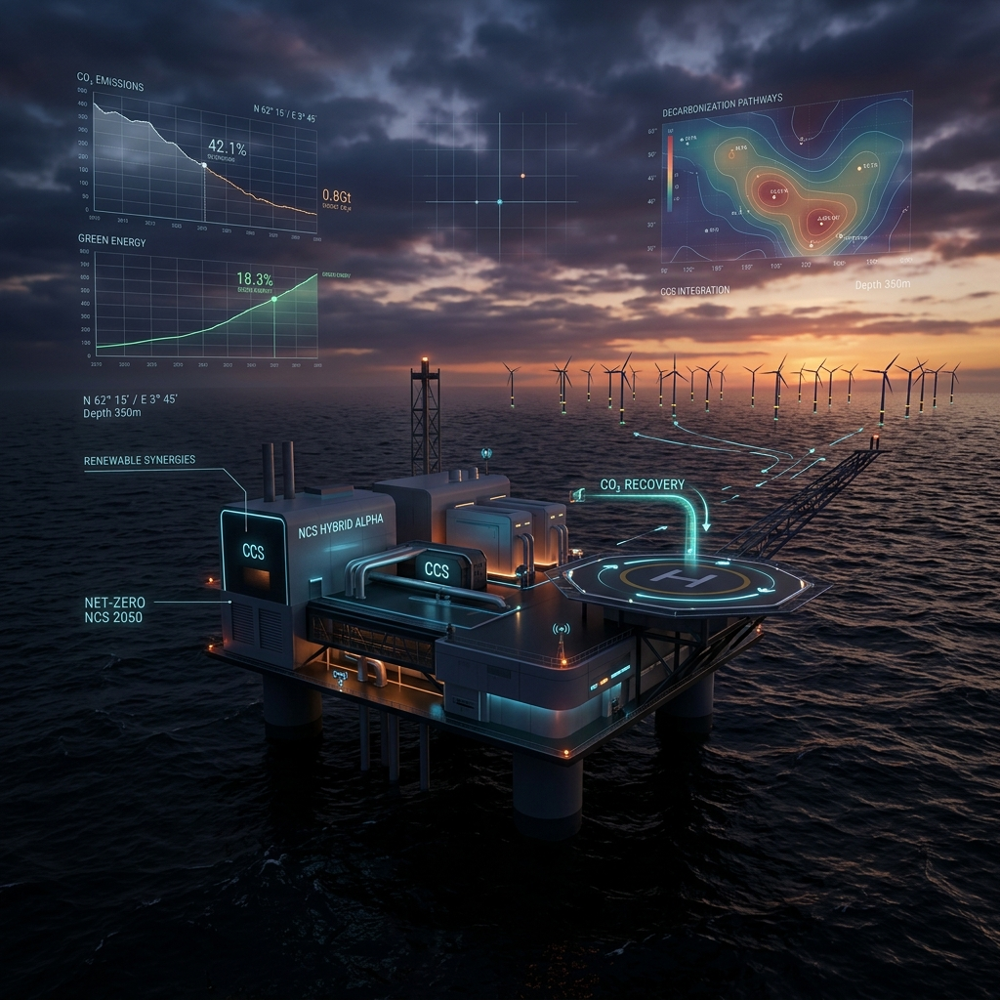
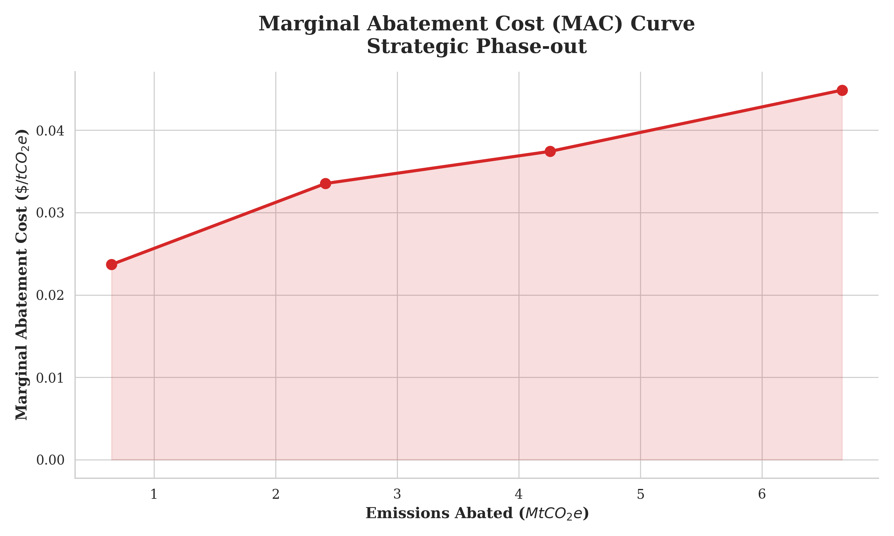

<div align="center">
  

  # Decarbonizing the Norwegian Continental Shelf
  ### *An Algorithmic Policy Framework for the 2030 "Fit For 55" Mandate*

  [](https://www.python.org/downloads/)
  [](LICENSE)
  [](https://pandas.pydata.org/)
  [](https://geopandas.org/)
  [](https://seaborn.pydata.org/)
</div>

---

## 🌍 Strategic Overview

As of **May 2026**, the Norwegian Continental Shelf (NCS) stands at a critical juncture. With the **2030 "Fit For 55"** deadline approaching, Norway must reconcile its role as a vital supplier of European energy security with its legally binding commitment to reduce emissions by 55%.

This repository provides a **world-class algorithmic framework** to solve this optimization problem. Moving beyond broad carbon pricing, we use **Double Machine Learning (DML)** and **Linear Programming** to identify surgical, field-level interventions that maximize economic production while meeting strict environmental mandates.

## 📊 Key Analytical Insights

Our models evaluate the two primary pathways for the NCS: **Targeted Electrification** versus **Strategic Production Phase-out**.

### 1. The Pareto Efficiency of Production
Our analysis reveals extreme heterogeneity across the shelf. A small cluster of late-life, carbon-intensive fields accounts for a disproportionate share of total emissions. 

<div align="center">
  
</div>

### 2. Marginal Abatement Cost (MAC)
We derive the real economic cost of abatement. While the first 20% of emissions can be abated at near-zero marginal cost by retiring inefficient tail-end assets, deeper cuts face a sharp inflection point where costs skyrocket.

<div align="center">
  
</div>

### 3. Core Findings
- **Electrification Strategy:** Electrifying just **13 specific field hubs** is mathematically sufficient to meet the 55% reduction target without any loss in production.
- **Phase-out Strategy:** A surgical production cut of **28%**—focused exclusively on high-intensity fields—can yield a massive **68% reduction** in lifetime emissions.

---

## 🛠 Project Structure

```bash
├── assets/             # World-class visualizations and media
├── data/               # Production and emission datasets (NPD/NorskeUtslipp)
├── paper/              # Academic manuscript (Markdown/LaTeX pipeline)
│   ├── 00a_title_page.md
│   ├── 01_introduction.md
│   ├── 02_methods.md
│   ├── ...
│   └── compile_paper.py
├── src/                # Modular Python research pipeline
│   ├── 01_data_building.py
│   ├── 02_data_cleaning.py
│   ├── ...
│   └── 05_optimization.py
└── main.py             # End-to-end pipeline orchestrator
```

## 🚀 Getting Started

### Prerequisites
- Python 3.9+
- [Pandoc](https://pandoc.org/) (required for PDF/LaTeX manuscript compilation)

### Quick Execution
To run the full research pipeline (Data Processing -> Modeling -> Optimization -> Visualization):

```bash
# Clone the repository
git clone https://github.com/percw/Norwegian_oil_gas_decarbonization.git
cd Norwegian_oil_gas_decarbonization

# Run the end-to-end pipeline
python main.py
```

### Compiling the Paper
To generate the latest version of the academic manuscript:

```bash
cd paper
python compile_paper.py
```

---

## 🎓 Academic Framing

This research bridges the gap between top-down macroeconomic mandates and field-level operational realities. By utilizing **Double Machine Learning** to orthogonalize high-dimensional confounders, we provide an unbiased look at the causal drivers of offshore carbon intensity.

## 📄 License

This project is licensed under the **MIT License**. See the [LICENSE](LICENSE) file for professional details.

---
<div align="center">
  <sub>Built for impact. Analyzed with precision. Updated May 2026.</sub>
</div>
