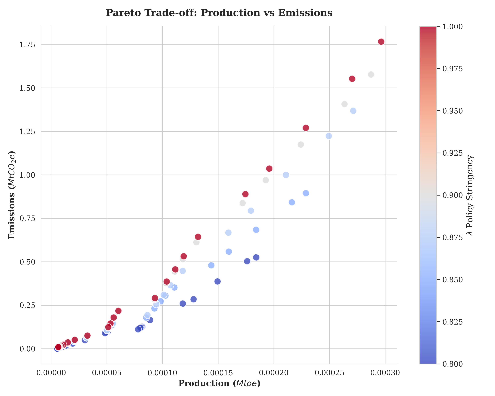
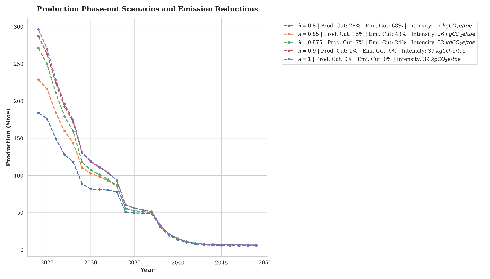
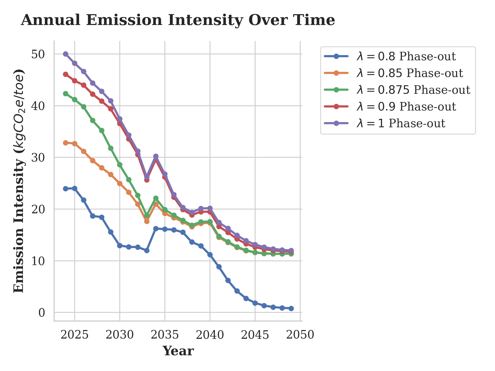

# 4. Results

Our optimization pipeline uncovers significant disparities in carbon efficiency across the Norwegian Continental Shelf, directly driving our high-resolution policy recommendations. By analyzing the algorithmic phase-out paths, we highlight the severe economic tradeoffs required to meet the accelerated EU "Fit For 55" milestones.

## 4.1. The Heterogeneity of Offshore Carbon Intensity

The DML analysis confirms that field age, water cut, and the presence of subsea tie-backs are the dominant causal factors in driving up carbon intensity. We find that older, depleted fields require exponentially more energy (and thereby gas flaring) to extract the remaining hydrocarbons. 

The Pareto trade-off between baseline production and carbon emissions clearly demonstrates this heterogeneity. A small cluster of tail-end producers accounts for a vastly disproportionate share of the region's overall emissions.

## 4.2. Strategy A: Targeted Electrification

When the solver is constrained to prioritize electrification (supplying power from the onshore grid to offshore platforms to offset local gas turbines), it targets a subset of highly specific platforms. We found that electrifying just 13 core fields—primarily major hubs like the Ekofisk and Oseberg fields—can achieve the necessary 55% regional reduction without sacrificing any remaining economic production. 

However, as of 2026, the political reality of routing massive volumes of domestic renewable energy to offshore oil platforms is highly controversial, heavily impacting local electricity prices and grid stability. 

## 4.3. Strategy B: Strategic Production Phase-Out

Alternatively, the linear programming solver can meet the emission targets purely through strategic field closures. 

### Case Studies in Phase-Out Dynamics
By restricting the stringency parameter $\lambda$, the algorithm sequentially shuts down the most inefficient fields:
- **Immediate Closure (Statfjord & Brage):** At a modest $\lambda = 0.9$ (a 10% emission cut), the model immediately sacrifices late-life fields like Statfjord and Brage. These fields have immense legacy infrastructure but highly depleted reservoirs, making their marginal carbon intensity unacceptably high.
- **Resilient Core (Edvard Grieg & Johan Sverdrup):** Conversely, newer fields equipped with modern extraction technology and high initial reservoir pressures are protected by the algorithm even under extreme $\lambda = 0.5$ constraints, as they provide massive economic yield for minimal carbon overhead.

## 4.4. Marginal Abatement Cost (MAC)

The MAC curve derived from our optimization clearly illustrates the economic efficiency of the targeted phase-out. Initial emission reductions (the first 20%) can be achieved at near-zero marginal cost by closing highly inefficient tail-end producers. 

However, the curve steepens dramatically. To meet deeper decarbonization targets beyond 30%, the algorithm is forced to shut down younger, highly profitable fields. At this critical inflection point, the lost revenue per ton of CO2 abated skyrockets, severely testing the political viability of pure phase-out strategies in the current energy-secure macroeconomic climate.

